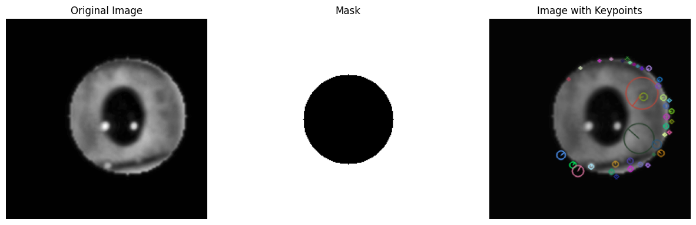

# 🧿 Iris Recognition Pipeline using CASIA Iris-Thousand

## Project Description

The **Iris Recognition Pipeline using CASIA Iris-Thousand** is a comprehensive solution designed to enhance biometric identification through iris recognition technology. This project leverages the CASIA Iris-Thousand dataset, a well-known database in the field of iris recognition research.

### Objectives

The primary objectives of this project are to:

- **Preprocess Iris Images**: Standardize input images for consistent analysis by resizing and cleaning them.
- **Annotate Iris Regions**: Use the LabelMe tool to accurately annotate the iris and pupil areas, ensuring precise feature extraction.
- **Extract Features Using SIFT**: Implement the Scale-Invariant Feature Transform (SIFT) algorithm to detect keypoints within the iris, facilitating robust recognition.

### Key Features

- **Image Preprocessing**: The pipeline efficiently loads and processes raw iris images, preparing them for subsequent analysis.
- **Annotation**: Utilizing LabelMe allows for the accurate annotation of iris regions, which is crucial for training and testing recognition algorithms.
- **Keypoint Detection**: By applying SIFT, the project identifies distinctive features within the iris, enhancing the reliability of recognition systems.

### Applications

This pipeline serves as a foundational tool for developing iris recognition systems, which can be applied in various fields, including:

- **Security**: Enhancing access control systems.
- **Healthcare**: Identifying patients in clinical settings.
- **Forensics**: Assisting in criminal investigations.

### Conclusion

The Iris Recognition Pipeline is an innovative approach to biometric identification, combining cutting-edge image processing techniques with robust feature extraction methods. This project not only contributes to the advancement of iris recognition technology but also serves as a valuable resource for researchers and developers in the field.

# 🧿 Iris Recognition Pipeline using CASIA Iris-Thousand

This project presents a comprehensive pipeline for iris recognition using the CASIA Iris-Thousand dataset. It includes:

- ✅ Image preprocessing  
- ✅ Iris and pupil region annotation with **LabelMe**  
- ✅ SIFT-based feature extraction and keypoint detection

---

## 📁 Project Overview

The pipeline is divided into three main stages:

### 1. 🔄 Preprocessing
- Load raw images from the CASIA Iris-Thousand dataset.
- Extract and display iris images using annotations.
- Resize images to a standard shape (224x224).
- Save cleaned, standardized versions for analysis.

📍 **Input:** Raw CASIA images  
📍 **Output:** `/iris_images_preprocessed`

### 2. 📝 Annotation using LabelMe
- Annotate iris and pupil regions using **LabelMe** with circle shapes.
- Export annotations as `.json` files.
- Extract iris regions from annotated coordinates.

📍 **Input:** LabelMe `.json` files + original images  
📍 **Output:** Masked iris images (optionally visualized for confirmation)

### 3. 🔍 SIFT Feature Extraction
- Create a binary mask to exclude the pupil region.
- Apply **SIFT** on the remaining iris area.
- Visualize and save keypoints.

📍 **Input:** Preprocessed iris images  
📍 **Output:** Keypoint images and feature data

### Keypoints Data

Here are the keypoints detected for `S5027L07_eye_1_iris.png`:

---

## 📊 Conclusion

This pipeline efficiently processes iris images and extracts keypoints, enhancing the accuracy of iris recognition systems. Your insights and feedback will be invaluable for further improvements.

## 📫 Contact Information

- **Name:** Raiane Yahiaoui
- **Email:** [ikba.king2015@gmail.com](mailto:ikba.king2015@gmail.com)
- **LinkedIn:** [linkedin.com/in/yahiaoui-raiane-253911262](https://www.linkedin.com/in/yahiaoui-raiane-253911262)

## 📄 License

This project is open for academic use and further research.
